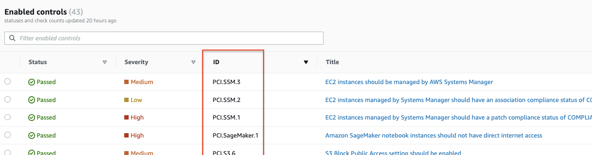
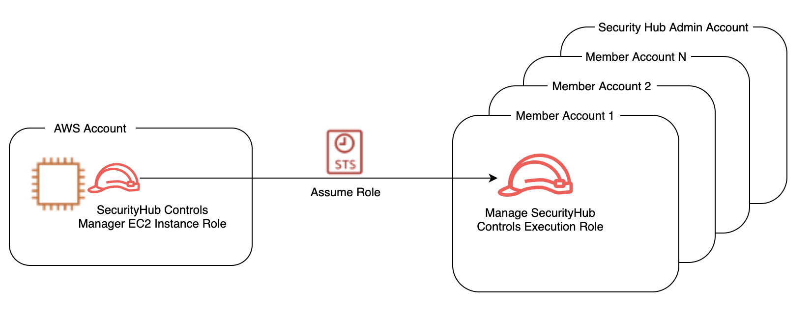
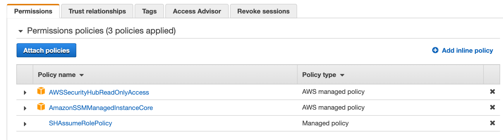
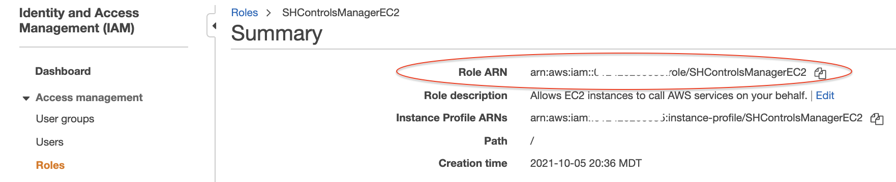
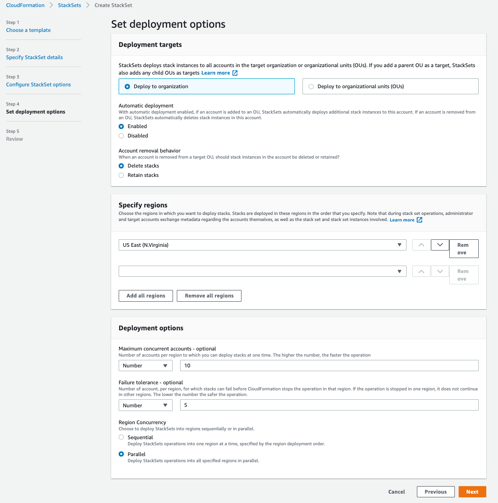
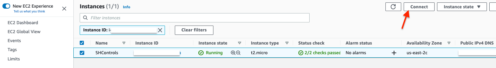
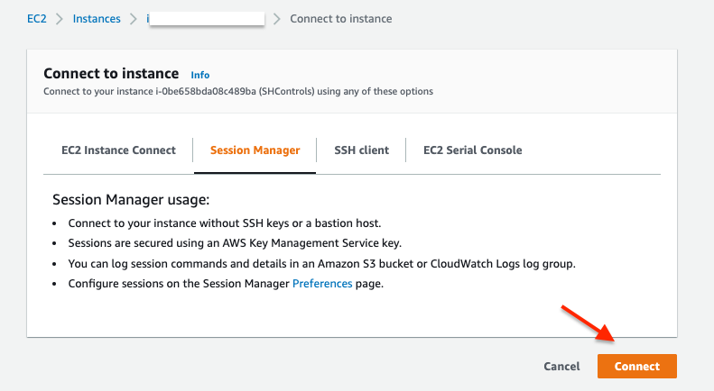
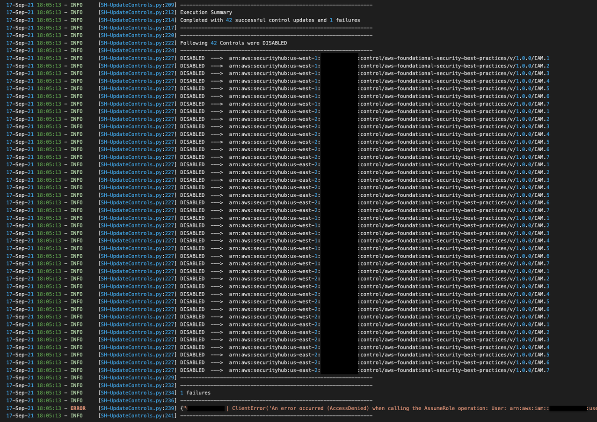
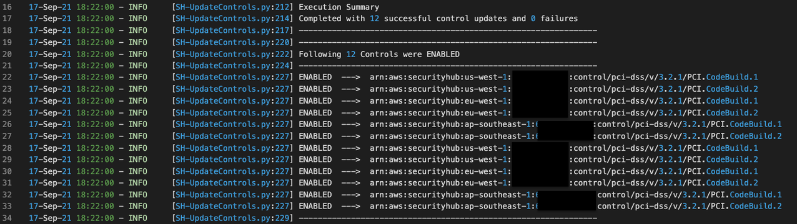

# Disabling Security Hub Controls in a Multi Account Environment


The 'update Security Hub controls' script is written in Python. It uses
AWS SDK for Python (Boto3) to assume a 'cross account IAM role' in the
accounts passed in the script and uses 'update-standards-control'
Security Hub API to enable or disable controls.

We will review the prerequisites in the next section to understand the
requirements for execution. We will then walk-through the instructions
for deploying this automation through an EC2 instance along with
examples of the script usage.


## Prerequisites:


The 'update Security Hub controls' script requires:

1.  An IAM role for cross-account access. You should have an IAM
    principal that is able to assume an IAM role in accounts where
    Security Hub controls needs to be disabled or enabled in. This role
    should have 'securityhub:UpdateStandardsControl' permission.

Note: If you used the [Security Hub multiaccount scripts from
awslabs](https://github.com/awslabs/aws-securityhub-multiaccount-scripts)
to enable Security Hub for multiple accounts you can use the role
provided in the repo for the purpose of this blog as it has the
necessary permissions.

2.  [AWS
    CLI](https://docs.aws.amazon.com/cli/latest/userguide/install-cliv2.html)

3.  [Python](http://python.org/)

4.  [Boto3](https://aws.amazon.com/sdk-for-python/).


## Update Security Hub controls Script


### Required arguments: 

```--input-file ```Path to CSV file containing the list of 12 digit [AWS account IDs](https://docs.aws.amazon.com/general/latest/gr/acct-identifiers.html) where you want to disable or enable controls in. If you are using [Security Hub delegated administrator](https://docs.aws.amazon.com/securityhub/latest/userguide/designate-orgs-admin-account.html) then you should use the [list-members](https://awscli.amazonaws.com/v2/documentation/api/latest/reference/securityhub/list-members.html) API to get a list of all accounts where security hub is enabled. Store this list in a CSV file, one account ID per line. 

```--assume-role``` Role name of the execution role in each account, this role should have the 'securityhub:UpdateStandardsControl' permission. If you will be using the execution role CloudFormation provided in solution deployment section (part B) , the name of this role is 'ManageSecurityHubControlsExecutionRole'  

```--regions``` Comma separated list of regions to update SecurityHub controls. Do not add any spaces after comma. Specify ALL for considering all regions where Security Hub is available. If you provided a region where you have not enabled Security Hub, the script will skip this region and log the failure. 

```--standard``` Enter the standard code **(AFSBP, CIS, PCIDSS).**

1.  AFSBP for [[AWS Foundational Security Best
    Practices]{.ul}](https://docs.aws.amazon.com/securityhub/latest/userguide/securityhub-standards-fsbp.html)

2.  CIS for [[CIS AWS
    Foundations]{.ul}](https://docs.aws.amazon.com/securityhub/latest/userguide/securityhub-standards-cis.html)

3.  PCIDSS for [[Payment Card Industry Data Security Standard (PCI
    DSS)]{.ul}](https://docs.aws.amazon.com/securityhub/latest/userguide/securityhub-standards-pcidss.html)

The script works with one [Security Hub
Standard](https://docs.aws.amazon.com/securityhub/latest/userguide/securityhub-standards.html)
at a time, for example you can only disable AFSBP controls in one
execution. If you want to disable multiple controls across AFSBP and CIS
standards you have to execute the script twice once each for AFSBP and
CIS controls.

```--control-id-list ```Comma separated list of controls, example for CIS enter - (1.1,1.2) or PCIDSS enter - (PCI.AutoScaling.1,PCI.CloudTrail.4). Do not add any spaces after comma. Control IDs can be found from the Security hub console → Security Standards → view results ---> ID Column in the enabled controls table. 



```--control-action``` For enabling controls use ENABLED for disabling controls use DISABLED  \--disabled-reason Reason for disabling the controls. If you have different reasons for disabling controls, you have to execute the script multiple times, once each for controls where the disable reason is the same. This argument is NOT used if you are enabling controls. 

### Optional arguments: 

```-h, --help ```

shows the help message and exit  

```--profile ``` If you do not use this argument the default profile will be used. Use
this argument to parse named profile. The credentials in this profile
should have permissions to assume the execution role in each account.


## Solution Deployment:

We will be using an EC2 instance with Amazon Linux 2 (AL2) to run this automation. We will create the instance role for the EC2 in part A, we will then create the execution role in part B, and finally launch the EC2 instance to run the 'Update Security Hub controls' script in part C. 

Note: For the purpose of this blog we will be creating the EC2 instance and the instance role in the Security Hub administrator account, however this is not a requirement. 

A.  Security Hub Controls Manager EC2 Role: This role should have
    permission to assume
    [(sts:AssumeRole](https://docs.aws.amazon.com/STS/latest/APIReference/API_AssumeRole.html))
    the execution role that is described in part B.
    

Figure 1

A sample policy for this role is provided below:
```
{
    "Version": "2012-10-17",
    "Statement": [
        {
            "Effect": "Allow",
            "Action": "sts:AssumeRole",
            "Resource": "arn:aws:iam::*:role/ManageSecurityHubControlsExecutionRole"
        }
    ]
}
```

1.  Navigate to the IAM console of the Security Hub administrator
    account, you will also need to have permission to Launch EC2
    instance in this account. [Create a new
    policy](https://docs.aws.amazon.com/IAM/latest/UserGuide/access_policies_create-console.html)
    using JSON policy editor and name it 'SHAssumeRolePolicy'. Copy and
    paste the above sample policy in the JSON editor. The 'resource' in
    the policy is the execution role, as will be described in the
    part B.

2.  In the IAM console, [Create an IAM role for
    EC2](https://docs.aws.amazon.com/AWSEC2/latest/UserGuide/iam-roles-for-amazon-ec2.html#create-iam-role)
    and name it 'SHControlsManagerEC2'. Assign the following policies:

    i.  The 'SHAssumeRolePolicy' policy you created in step 1.

    ii. 'AmazonSSMManagedInstanceCore' managed policy for managing the
        instance using [AWS Systems
        Manager](https://aws.amazon.com/systems-manager/).

    iii. 'AWSSecurityHubReadOnlyAccess' managed policy for allowing read
         only access to Security Hub.



3.  When you are finished creating the role , take note of the Amazon
    Resource Name (ARN), we will be using it in Part B. The ARN will
    look like this:

``` arn:aws:iam::*111111222222*:role/SHControlsManagerEC2```



Note: If you are using an existing role as the execution role then you will need to update the 'resource' section of the policy created in step 1 with the ARN of the execution role.

B.  Execution Role: **The execution role has to be created in all
    accounts you will be disabling or enabling controls in**. This role
    should have 'securityhub:UpdateStandardsControl' permission. The
    execution role [trust
    relationship](https://docs.aws.amazon.com/directoryservice/latest/admin-guide/edit_trust.html)
    should allow the Security Hub Controls Manager Role to assume the
    execution role. **The name of the execution role has to be the same
    in each account including the Security Hub administrator account
    otherwise the script will NOT work.**

A sample policy for the execution role is provided below:
```
{
    "Version": "2012-10-17",
    "Statement": [
        {
            "Effect": "Allow",
            "Action": "securityhub:UpdateStandardsControl",
            "Resource": "arn:aws:securityhub:*:*:hub/default"
        }
    ]
}

```

 Execution role trust policy:

Note: the ARN in the 'principal' section below is the ARN you noted in step 3 of Security Hub Controls Manager EC2 Role.
```
{
  "Version": "2012-10-17",
  "Statement": [
    {
      "Effect": "Allow",
      "Principal": {
        "AWS": "arn:aws:iam::111111222222:role/SHControlsManagerEC2"
      },
      "Action": "sts:AssumeRole"
    }
  ]
}
```

If you are using [AWSOrganizations](https://www.google.com/search?q=AWS+orgnazion&oq=AWS+orgnazion&aqs=chrome..69i57.2524j0j7&sourceid=chrome&ie=UTF-8),you can use [[CloudFormationStackSets]{.ul}](https://docs.aws.amazon.com/AWSCloudFormation/latest/UserGuide/stacksets-getting-started.html) to deploy this execution role easily across all of your accounts. The stack set runs across the organization at the root or organizational units (OUs) level of your choice. The Cloudformation will use the ARN you noted from Security Hub Controls Manager EC2 Role as a parameter.

1.  Login to the console of the Organizations management account or [CloudFormation delegated administrator](https://docs.aws.amazon.com/AWSCloudFormation/latest/UserGuide/stacksets-orgs-delegated-admin.html) account.

2.  Click on the button below to launch the StackSet

Launcg button coming soon

3.  Enter the ARN of the Security Hub Controls Manager EC2 Role in the
    parameter section, then click next.

 

4.  (Optional) On the Configure StackSet options page, go to Tags and
    add [tags](https://docs.aws.amazon.com/general/latest/gr/aws_tagging.html) to
    identify and organize your stack set.


5.  On the Set deployment options page, select the desired Region. Since
    the resource being created is IAM you will only need to specify one
    region. Click next.

 

6.  Review the definition and select I acknowledge that AWS
    CloudFormation might create IAM resources. Choose Submit.

7.  After you choose Submit, you can monitor the creation of the
    StackSet from the Operations tab to ensure that deployment is
    successful.

 Note: StackSets does not deploy stack instances to the organization\'s
 management account, even if the management account is in your
 organization or in an OU in your organization. You will need to create
 the execution role manually in the organization management account.

C.  Launch EC2: We will be using an t2.micro EC2 instance with Amazon
    Linux 2 (AL2) image which comes preinstalled with AWS CLI and
    Python. This instance size and image are [free tier
    eligible](https://aws.amazon.com/free/?all-free-tier.sort-by=item.additionalFields.SortRank&all-free-tier.sort-order=asc&awsf.Free%20Tier%20Types=*all&awsf.Free%20Tier%20Categories=*all).


1.  [Launch EC2
    instance](https://docs.aws.amazon.com/AWSEC2/latest/UserGuide/EC2_GetStarted.html#ec2-launch-instance)
    in the Security Hub administrator account. You can use any region.

2.  [Attach the IAM role to the
    instance](https://aws.amazon.com/blogs/security/easily-replace-or-attach-an-iam-role-to-an-existing-ec2-instance-by-using-the-ec2-console/)
    as created in part A.

3.  Confirm instance is in a 'running' state,

4.  [Login to the instance
    CLI](https://docs.aws.amazon.com/systems-manager/latest/userguide/session-manager-working-with-sessions-start.html#start-ec2-console)
    using [AWS Systems Manager Session
    Manager](https://docs.aws.amazon.com/systems-manager/latest/userguide/session-manager.html).
    Go to the EC2 console, select the instance and click connect.

 

 Note: You will need to allow outbound internet access to Systems
 manager endpoints for session manager to work,visit [session manager
 documentation](https://docs.aws.amazon.com/systems-manager/latest/userguide/session-manager-getting-started-privatelink.html)
 for more information.

5.  On the next page, click connect again.



6.  A new window with session manager will open.

7.  Set the working directory to home directory.

```$ cd /home/ssm-user```

8.  Install Git:

```$ sudo yum install git```

9.  Clone the UpdateSecurityHubControls repo.


```$ git clone https://github.com/aws-samples/securityhub-updatecontrols-script.git ```

10. [Start a virtual
    environment](https://aws.amazon.com/premiumsupport/knowledge-center/ec2-linux-python3-boto3/).

```$ python3 -m venv  securityhub-updatecontrols-script/env```

```$ source  securityhub-updatecontrols-script/env/bin/activate ```

11. Upgrade pip and Install boto3

```$ pip install pip --upgrade ```

```$ pip install boto3 ```

You are now ready to execute the script.

**Example 1 - Disabling Controls:** Lets assume you have Config global
recording enabled in us-east-1 and want to disable controls associated
with global resources (IAM.1, IAM.2, IAM.3, IAM.4, IAM.5, IAM.6, IAM.7)
for AWS Foundational Security Best Practices standard in regions
us-west-1, us-east-2 in all accounts. The name of our execution role in
all accounts is 'ManageSecurityHubControlsExecutionRole'

12. ```$ cd securityhub-updatecontrols-script```

13. Create a file with the list of account IDs. This will be passed with
    the 'input-file' argument.

```$ nano accounts.csv```

 Enter account IDs one account per line, then save the file.

 

14. Execute the script:

``` 
$ python SH-UpdateControls.py \
--input-file accounts.csv \
--assume-role ManageSecurityHubControlsExecutionRole \
--regions us-east-2,us-west-1 \
--standard AFSBP \
--control-id-list IAM.1,IAM.2,IAM.3,IAM.4,IAM.5,IAM.6,IAM.7 \
--control-action DISABLED \
--disabled-reason 'Disabling IAM checks in all regions except for us-east-1, as global recording is enabled in us-east-1' 
```

15. As the script executes you will get a summary of disabled controls
    printed. If there are failures, the reason for failures will be
    printed in the summary. You will also see a log file saved in the
    directory with execution logs.

> 

**Example 2 - Enabling Controls:** Let's say you have disabled Control
ID PCI.CodeBuild.1 and PCI.CodeBuild.2 from the PCI standard in your
accounts as you did not use CodeBuild in your PCI environment in the
past. After a recent architecture review you decided to use AWS
CodeBuild in a your accounts in us-west-1, eu-west-1, ap-southeast-1.
The name of our execution role in all accounts is
'ManageSecurityHubControlsExecutionRole.

Confirm you have completed all steps in part C.

11. ```$ cd securityhub-updatecontrols-script ```

12. Create a file with the list of account IDs. This will be passed with
    the 'input-file' argument.

``` $ nano accounts.csv ```

Enter account IDs one account per line, then save the file.

 

13. Execute the script

```
$ python SH-UpdateControls.py \
--input-file accounts.csv \
--assume-role ManageSecurityHubControlsExecutionRole \
--regions us-west-1,eu-west-1,ap-southeast-1 \
--standard PCIDSS \
--control-id-list PCI.CodeBuild.1,PCI.CodeBuild.2 \
--control-action ENABLED
```

14. As the script executes you will get a summary of enabled controls
    printed. If there are failures the reason for failures will be
    printed in the summary You will also see a log file saved in the
    directory with execution logs.




If you have trouble with the scripts then please open an
issue in GitHub.
